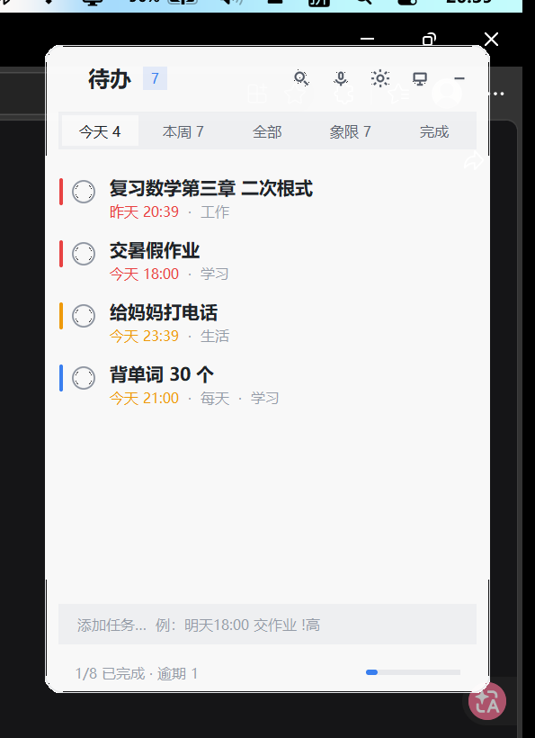
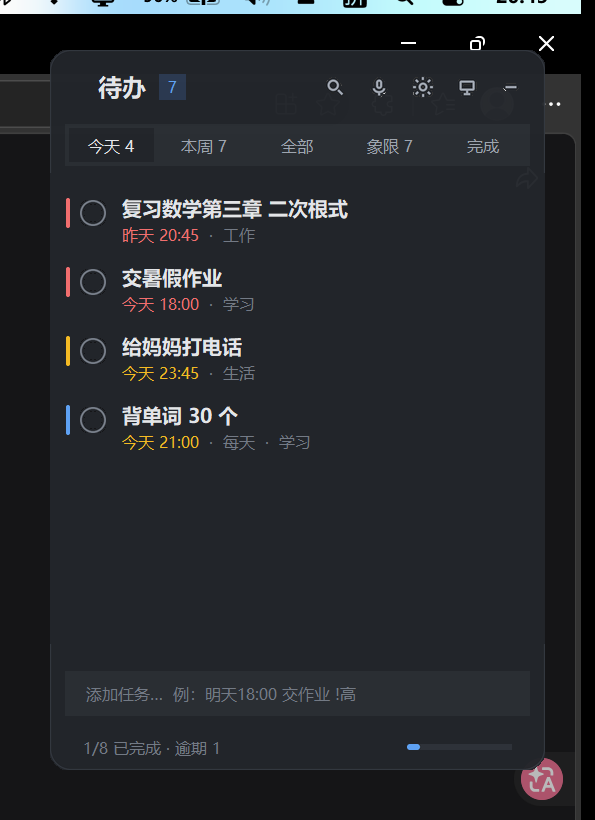
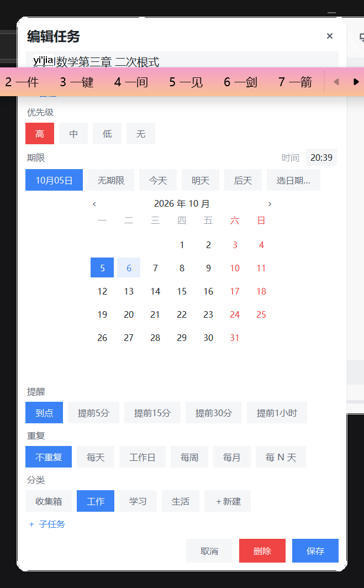
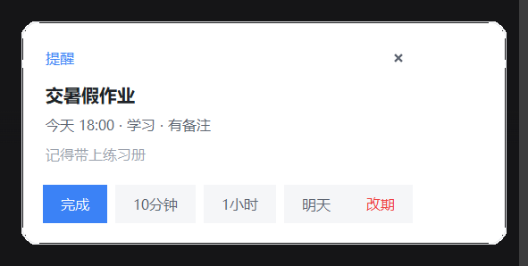
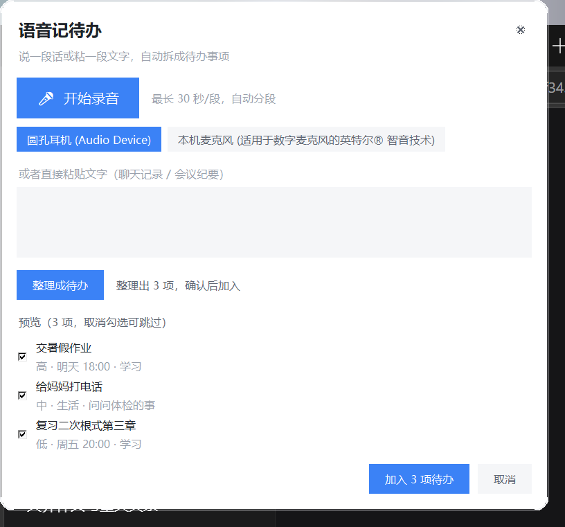
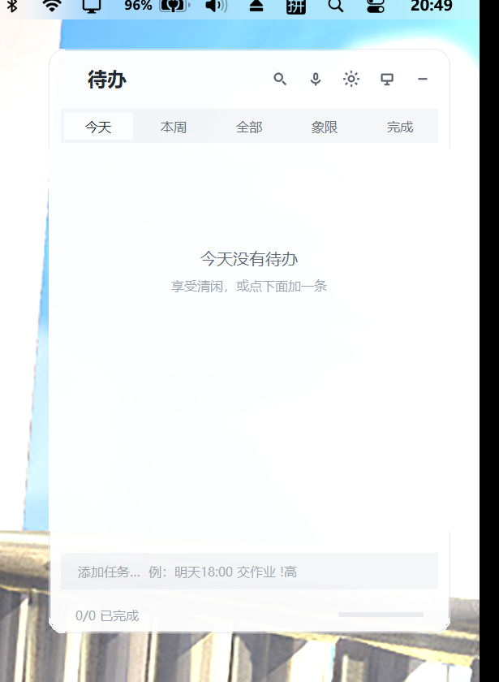

# 待办清单 · 桌面小工具

贴在桌面上的待办卡片。开机自启、不占地方、不挡任何窗口，到点弹提醒，还支持语音/文字一键转成待办。

用 Python + tkinter 自己画的界面，**不需要安装任何东西**（Python 3.14、tkinter、pywin32、Pillow、openai 都是现成的）。



| 深色主题 | 编辑与日历 |
|---|---|
|  |  |

| 提醒弹窗 | 语音转待办 |
|---|---|
|  |  |

贴桌面实拍（Win+D 显示桌面后，卡片在 Wallpaper Engine 动态壁纸之上）：



---


## 快速开始

双击 `启动.bat`（或运行 `pythonw main.py`）。窗口会出现在屏幕右上角。

第一次用建议先点右上角的 ⚙ 进设置：
1. **系统** → 打开「开机自动启动」
2. **语音与AI** → 填入智谱 API Key（不填也不影响待办功能，只是不能语音转文字）

## 怎么用

**加任务**：在底部输入框直接打字回车，支持自然语言：

| 你打的字 | 效果 |
|---|---|
| `明天18:00 交暑假作业 !高 #学习` | 明天 18:00 到期、高优先级、归到「学习」 |
| `周五 交周报` | 本周五 09:00 |
| `3天后 复查` | 三天后 09:00 |
| `下午3点半 开会` | 今天 15:30（已过则明天） |
| `30分钟后 喝水` | 半小时后 |
| `买菜` | 无期限的普通任务 |

优先级写 `!高`/`!中`/`!低`（也认 `!h`/`!m`/`!l`），分类写 `#学习`。

输入过程中输入框上方会实时显示解析结果（`⏰ 明天 18:00   ⚑ 高   # 学习`），确认无误再回车。

**操作任务**：
- 点左边圆圈 → 完成（重复任务会自动生成下一次）
- 点整行 / 双击 → 打开编辑面板
- 右键 → 改优先级、延期、移动分类、删除
- 按住上下拖动 → 调整顺序
- 鼠标悬停行尾 → 出现编辑 / 删除按钮

**视图**：今天 / 本周 / 全部 / 象限 / 完成

**其他**：
- 点标题栏空白处拖动可移动窗口，位置会自动记住
- 双击标题栏 → 切换「贴在桌面的方式」
- 加任务时输入框留空按 Esc 会失焦回落到桌面层

## 键盘快捷键

| 快捷键 | 作用 | 可改 |
|---|---|---|
| `Ctrl+Alt+T` | 唤出 / 收起窗口 | 设置 → 系统 |
| `Ctrl+Alt+V` | 语音记待办 | 设置 → 系统 |
| `Ctrl+F` | 搜索 | — |
| `Enter` | 添加任务 / 保存 | — |
| `Esc` | 关闭当前面板 | — |

热键被别的程序占用时会自动换成备用组合，并弹提示告诉你换成了什么。

## 语音记待办

按 `Ctrl+Alt+V`（或点顶栏麦克风图标）：

1. 点「开始录音」说话，或直接粘一段文字（聊天记录、会议纪要都行）
2. 点「整理成待办」
3. AI 把内容拆成一条条待办，自动判断优先级、换算时间、归到分类
4. 勾选要保留的，点「加入 N 项待办」

录音用的是你机器里已有的 ffmpeg（imageio-ffmpeg 自带），不需要额外安装。智谱单次转写上限 30 秒，更长的录音会自动分段拼接。

**要真正用起来需要**：去 [open.bigmodel.cn](https://open.bigmodel.cn) 注册，创建一个 API Key，填到「设置 → 语音与AI」里，点「测试」确认连通。
- 转写模型 `glm-asr-2512`：按量计费，很便宜
- 拆解模型 `glm-4.7-flash`：目前免费

## 提醒

到点会弹一张卡片（右下角），直接给出【完成】【10分钟】【1小时】【明天】【改期…】按钮，不用打开主界面就能处理掉。

- 关机期间错过的提醒，下次启动时会汇总成一张卡片告诉你
- 可以在设置里开免打扰时段
- 默认只弹自绘窗口；如果还想要系统通知或提示音，设置 → 提醒里可以开

## 贴桌面：三种方式

| 方式 | 说明 |
|---|---|
| **贴桌面·置底**（默认） | 窗口压在所有窗口之下，不挡任何东西；点一下临时浮到最前让你输入，点别处回到底部。按 Win+D 显示桌面时它也在 |
| **嵌入桌面层**（实验） | 把窗口挂进系统桌面层，按 Win+D 完全不受影响。**但部分系统上会因为动态壁纸独占渲染而显示不出来**——程序启动时会实测像素自检，一旦发现显示不出来会自动切回「置底」并提示你 |
| **常驻置顶** | 一直在最前面 |

> 实测说明：你这台机器装了 Wallpaper Engine，桌面层被它独占渲染，所以**「嵌入桌面层」在这台机器上显示不出来**，自检会自动回退到「贴桌面·置底」。日常用默认的「置底」就好，效果一样：Win+D 之后它就在桌面上。

## 数据

- 数据文件：`%APPDATA%\TodoWidget\data.json`（任务 + 分类）
- 配置：`%APPDATA%\TodoWidget\config.json`
- 备份：`%APPDATA%\TodoWidget\backups\`，每天首次启动自动备份，保留最近 7 份
- 崩溃日志：`%APPDATA%\TodoWidget\error.log`

用 JSON 而不是数据库是刻意的：任务量小，你随时能自己打开看、备份、手改。设置 → 数据里可以一键打开文件夹、导出 JSON/CSV、导入 JSON。

程序目录可以随便挪（数据在 APPDATA 里，不会丢）。但如果挪了目录，记得重新开关一次开机自启（快捷方式里记的是绝对路径）。

## 开机自启是怎么实现的

在「启动」文件夹放一个快捷方式，指向 `pythonw.exe`，所以不会有黑框闪一下。你可以在「任务管理器 → 启动应用」里看到它，也可以直接在设置里关掉。

启动后默认等 8 秒再出现（等桌面就绪），这个延迟在「设置 → 系统」里可调。

## 出问题了怎么办

**界面发虚/错位**：程序已开启 Per-Monitor V2 DPI 感知，正常不会。如果换了显示器，重启一次程序。

**热键没反应**：多半被别的软件占了，设置 → 系统里换一个组合。程序也会自动尝试备用组合并提示。

**没有声音/录音失败**：设置 → 语音与AI → 「检测麦克风」，选对设备。如果列表是空的，说明没找到 ffmpeg 或没有麦克风。

**语音按钮提示没配 Key**：填 API Key 才能转写。文字整理这条路也需要 Key。

**窗口不见了**：按 `Ctrl+Alt+T` 唤回。如果彻底退出了，重新运行 `main.py`。

**想彻底卸载**：关掉开机自启 → 退出程序 → 删掉程序目录和 `%APPDATA%\TodoWidget`。

---

## 给开发者

```
app/
  config.py         配置读写（%APPDATA%\TodoWidget）
  models.py         任务 / 子任务 / 重复规则
  nlp.py            自然语言时间解析
  store.py          持久化（原子写 + 每日备份）、查询、统计
  theme.py          配色 + Pillow 超采样预渲染圆角素材
  win32tools.py     DPI / 单实例 / 贴桌面 / 全局热键 / 托盘
  audio.py          ffmpeg 录音与分段
  ai.py             智谱转写 + 任务拆解
  autostart.py      开机自启快捷方式
  application.py    主控（定时器、事件循环、动作分发）
  ui/               主窗口、编辑器、提醒、设置、语音面板
```

### 测试与自检

```bash
python -m unittest discover -s tests -t .     # 单元测试（61 项）
python tools/smoke_test.py                    # 端到端冒烟（33 项，真跑程序）
python tools/preview.py                       # 界面截图（隔离数据，不碰你真数据）
python tools/acceptance.py bottom             # 验收：启动耗时/内存/贴桌面/Win+D/热键
python tools/desktop_probe.py all             # 贴桌面三种模式诊断
```

`tools/` 里的工具都用 `TODOWIDGET_HOME` 环境变量把数据目录指向临时目录，不会污染真实数据。设置这个环境变量也可以做便携版（数据跟着程序目录走）。

### 几个踩过的坑（改代码前值得一看）

1. **`-alpha` 和 `-transparentcolor` 会互相覆盖**（都是 `SetLayeredWindowAttributes`，后调的顶掉前一个的 flag）。圆角+透明度必须一起设，见 `win32tools.apply_layered_window`。
2. **Theme 的绘制原语收物理像素**，逻辑尺寸要先用 `theme.px()` 换算。早期两边都换算过一次，导致卡片被放大 1.5 倍、圆角跑到窗口外。
3. **矩形的 Frame 会盖住卡片圆角**，所有铺满宽度的实体控件都得往内缩一点（`place_all` 里的 `edge`）。
4. **`RegisterHotKey` 必须在窗口所属线程调用**，否则报 1408。
5. **别用 `win32gui.RegisterHotKey`**：pywin32 这个包装有时抛异常、有时静默返回 0，还会吃掉 `GetLastError`。用 ctypes 直接调 user32。
6. **嵌入桌面层会"假成功"**：`SetParent` 到 Progman 后父窗口、坐标、可见性全部正常，但屏幕上什么都不显示。必须实测像素才能判断，见 `DesktopPinner.desktop_layer_coverage`。
7. **Tkinter 不是线程安全的**：所有网络/录音操作跑在后台线程，结果通过 `queue` 回到主线程；定时任务一律用 `root.after`，不开业务线程。
8. **ctypes 调 Win32 必须声明 `argtypes`**：64 位下句柄是指针宽度，不声明就按 32 位 int 传，句柄被截断、调用静默失败。见 `win32tools` 顶部的类型声明块。
9. **量窗口尺寸一定要在进程内量**：从没有 DPI 感知的脚本去 `GetWindowRect`，拿到的坐标会被 DPI 虚拟化（144 DPI 下看起来"小了 1.5 倍"），会得出完全错误的结论。用 `win32tools.dpi_report()` 在本进程内测。
